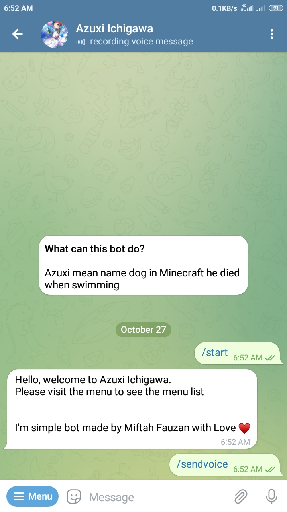

<!-- Improved compatibility of back to top link: See: https://github.com/othneildrew/Best-README-Template/pull/73 -->
<a name="readme-top"></a>
<!--
*** Thanks for checking out the Best-README-Template. If you have a suggestion
*** that would make this better, please fork the repo and create a pull request
*** or simply open an issue with the tag "enhancement".
*** Don't forget to give the project a star!
*** Thanks again! Now go create something AMAZING! :D
-->


<!-- PROJECT SHIELDS -->
<!--
*** I'm using markdown "reference style" links for readability.
*** Reference links are enclosed in brackets [ ] instead of parentheses ( ).
*** See the bottom of this document for the declaration of the reference variables
*** for contributors-url, forks-url, etc. This is an optional, concise syntax you may use.
*** https://www.markdownguide.org/basic-syntax/#reference-style-links
-->
[![Contributors][contributors-shield]][contributors-url]

[![Stargazers][stars-shield]][stars-url]
[![Issues][issues-shield]][issues-url]


<!-- PROJECT LOGO -->
<br />
<div align="center">
  <a href="#">
    
  </a>

  <h3 align="center">NyanBot | Telegram bot</h3>

  <p align="center">
    Simple project bot using python
    <br />
    <a href="http://web.miftahfauzan.rf.gd"><strong>About author »</strong></a>
    <br />
    <br />
    <a href="">View Demo</a>
    ·
    <a href="https://github.com/erikaanyann/NyanBot-Project/issues">Report Bug</a>
    ·
    <a href="https://github.com/erikaanyann/NyanBot-Project/issues">Request Feature</a>
  </p>
</div>


<!-- TABLE OF CONTENTS -->
<details>
  <summary>Table of Contents</summary>
  <ol>
    <li>
      <a href="#getting-started">Getting Started</a>
      <ul>
        <li><a href="#prerequisites">Prerequisites</a></li>
        <li><a href="#installation">Installation</a></li>
      </ul>
    </li>
    <li><a href="#usage">Usage</a></li>
    <li><a href="#license">License</a></li>
    <li><a href="#contact">Contact</a></li>
    <li><a href="#acknowledgments">Acknowledgments</a></li>
  </ol>
</details>


<!-- ABOUT THE PROJECT -->
## About The Project




<p align="right">(<a href="#readme-top">back to top</a>)</p>


<!-- GETTING STARTED -->
## Getting Started

This is an example of how you may give instructions on setting up your project locally.
To get a local copy up and running follow these simple example steps.

### Prerequisites

This is an example of how to list things you need to use the software and how to install them.
* Python
  ```sh
  pkg install python
  ```

### Installation

_Below is an example of how you can instruct your audience on installing and setting up your app. This template doesn't rely on any external dependencies or services._

1. Clone the repo
   ```sh
   git clone https://github.com/erikaanyann/NyanBot-Project.git
   ```
2. Install pip packages
   ```sh
   pip install -r requirements.txt
   ```

<p align="right">(<a href="#readme-top">back to top</a>)</p>


<!-- USAGE EXAMPLES -->
## Usage

Use this space to show useful examples of how a project can be used. Additional screenshots, code examples and demos work well in this space. You may also link to more resources.

_For more examples, please refer to the [Documentation](https://example.com)_

<p align="right">(<a href="#readme-top">back to top</a>)</p>


<!-- LICENSE -->
## License

Distributed under the MIT License. See `LICENSE.md` for more information.

<p align="right">(<a href="#readme-top">back to top</a>)</p>


<!-- CONTACT -->
## Contact

Erikaanyann - [@KritozAe](https://twitter.com/KritozAe) - kritoproductionbusiness@gmail.com

Project Link: [https://github.com/erikaanyann/NyanBot-Project](https://github.com/erikaanyann/NyanBot-Project)

<p align="right">(<a href="#readme-top">back to top</a>)</p>


<!-- ACKNOWLEDGMENTS -->
## Acknowledgments

* [Choose an Open Source License](https://choosealicense.com)
* [GitHub Emoji Cheat Sheet](https://www.webpagefx.com/tools/emoji-cheat-sheet)
* [Malven's Flexbox Cheatsheet](https://flexbox.malven.co/)
* [Malven's Grid Cheatsheet](https://grid.malven.co/)
* [Img Shields](https://shields.io)
* [GitHub Pages](https://pages.github.com)
* [Font Awesome](https://fontawesome.com)
* [React Icons](https://react-icons.github.io/react-icons/search)

<p align="right">(<a href="#readme-top">back to top</a>)</p>


<!-- MARKDOWN LINKS & IMAGES -->
<!-- https://www.markdownguide.org/basic-syntax/#reference-style-links -->
[contributors-shield]: https://img.shields.io/github/contributors/erikaanyann/NyanBot-Project.svg?style=for-the-badge
[contributors-url]: https://github.com/erikaanyann/NyanBot-Project/graphs/contributors
[forks-shield]: https://img.shields.io/github/forks/erikaanyann/NyanBot-Project.svg?style=for-the-badge
[forks-url]: https://github.com/erikaanyann/NyanBot-Project/network/members
[stars-shield]: https://img.shields.io/github/stars/erikaanyann/NyanBot-Project.svg?style=for-the-badge
[stars-url]: https://github.com/erikaanyann/NyanBot-Project/stargazers
[issues-shield]: https://img.shields.io/github/issues/erikaanyann/NyanBot-Project.svg?style=for-the-badge
[issues-url]: https://github.com/erikaanyann/NyanBot-Project/issues
[license-shield]: https://img.shields.io/github/license/erikaanyann/NyanBot-Project.svg?style=for-the-badge
